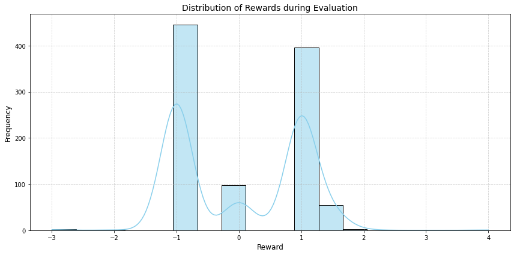

# CSE150A_Group_Project

## Dataset
We are using the following dataset for our project:

- [Blackjack Hands Dataset](https://www.kaggle.com/datasets/dennisho/blackjack-hands)

The dataset is too large to be uploaded to GitHub.  
You need to download it from the link. (50,000,000 test size.)

## PEAS description
*   **Performance Measure:**
    *   Maximize long-term winnings (or minimize losses) in Blackjack, predict the action with the highest likelihood.
*   **Environment:**
    *   Single-player Blackjack game against a dealer.
    *   The "world" consists of:
        *   A finite deck of cards (typically multiple decks shuffled together).
        *   Blackjack rules (dealer hits on soft 17, etc.).
        *   The state of the game: dealer's up card, player's hand (or hand value), actions taken, and the game outcome.
        *   The agent operates in a *static* environment as the rules don't changes.
        *   The environment is *partially observable* as the agent doesn't see the dealer's hole card or the entire deck.
        *   The environment is *stochastic* as the cards dealt are random.
        *   The environment is *sequential* as past actions affect future states.
*   **Actuators:**
    *   Actions: Hit (H), Stand (S), Double Down (D), Split (P), Surrender (R), Insurance (I), No Insurance (N).
*   **Sensors:**
    *   Dealer's up card (`dealer_up`).
    *   Player's final hand value (`player_final_value`).
    *   Prior actions of player's action.
    *   Game outcome (win, loss, push).

## Type of Agent
This Blackjack AI agent is primarily a **Utility-Based Agent**, the reasons are:

*   **Utility-Based:** The ultimate goal is to maximize the *utility* of the agent, which is measured as long-term winnings (or minimize losses). It aims to choose actions that lead to the highest expected utility. However, the actual "utility" is learned through the probability of winning, given the action.
*   **Probabilistic Agent:** The agent explicitly reasons about probabilities (different actions) to make decisions. When the agent chooses the action with the highest Q-value, the Q-values themselves represent the agent's belief about the expected return, which is influenced by the probabilities inherent in the environment. The agent might "believe" that standing has a higher expected reward in a particular state, but there's still a chance that hitting could lead to a better outcome due to the random card draw.

## Dataset Exploration
TBD

## Probabilistic Modeling and the Agent's Setup
* State Definition: We first define what the agent "sees" or "knows" about the game at any given moment. This is the state. In our case, the state consists of:
  * Player's hand value (sum of the cards)
  * Dealer's upcard (the dealer's visible card)
  * Usable Ace (whether the player has an Ace that can be counted as 11 without busting)
  * True Count (a card counting metric).
* Action Space: We define the set of actions the agent can take. For simplicity, we focus on just two:
    * Hit (H): Take another card.
    * Stand (S): End the hand and compare with the dealer. More advanced versions could include Double Down, Split, Surrender.
* Reward Function: We define how the agent is "rewarded" or "punished" for its actions.
  * The reward is based on the outcome of the hand:
    * Win: Positive reward (the amount won).
    * Loss: Negative reward (the amount lost).
    * Push (Tie): Zero reward.
* Q-Table Initialization: The agent's "memory" is stored in a Q-table. This table is initialized with zeros. It's a dictionary-like structure that maps each possible state-action pair to an estimated Q-value. We use a defaultdict so we don't have to pre-populate the table.

## Training the Model
1. Iterate Through Episodes.
2. Observe the State: For each hand in the training data, the agent observes the current state (player hand, dealer upcard, etc.).
3. Choose an Action (Epsilon-Greedy): The agent uses an epsilon-greedy policy to choose an action:
4. With probability epsilon (the exploration rate), the agent chooses a random action (either Hit or Stand).
5. With probability 1 - epsilon, the agent chooses the action that has the highest estimated Q-value in the Q-table for the current state. This is to exploit its current knowledge.
6. Check for valid actions: Check for valid actions based on the rules
7. Take the Action: The agent "takes" the action and receives a reward based on the outcome of the hand.
8. Observe the Next State: The agent observes the next state (the new player hand, if it hit, or the end of the hand).
9. Update the Q-Table: Update rule:
```python
Q(state, action) = Q(state, action) + alpha * (reward + gamma * max(Q(next_state, all_actions)) - Q(state, action))
```

## Evaluating the Model
1. Iterate Through Evaluation Hands: The agent processes a set of blackjack hands.
Observe the State: The agent observes the current state.
2. Choose the Best Action: The agent chooses the action with the highest Q-value in the Q-table for the current state. There's no random exploration during evaluation.
3. Take the Action: The agent "takes" the action and receives a reward.
4. Calculate the Average Reward: The total reward is calculated over the evaluation hands, and the average reward per hand is computed.

We regard the following as the Evaluation Metrics:
- Average Reward per Hand: This is the primary metric. It indicates the agent's average profit or loss per hand. A positive average reward means the agent is making a profit.
- Win Rate: The percentage of hands the agent wins.
- Comparison to Baseline: Compare the agent's performance to a basic strategy player or a random player.

We get the following graphs as a process shower:



### Conclusion of the Reinforcement Learning Model
TBD

Notes: The average reward is positive (0.0325) means that the agent is making a small profit per hand. This is a good starting point. The agent is winning slightly more than it's losing. Since the starting bet is 1, this means that for every 100 hands, our agent is expected to win 3.25 on top of that one bet (which is a promising start lol).


### Potential Improvements
TBD

Notes: May talk about the gpu resource, we need more episodes(iterations) to make the agent stronger. Now it's 100, can be maybe 5000-10000 episodes. Moreover, can talk about parameter tuning.