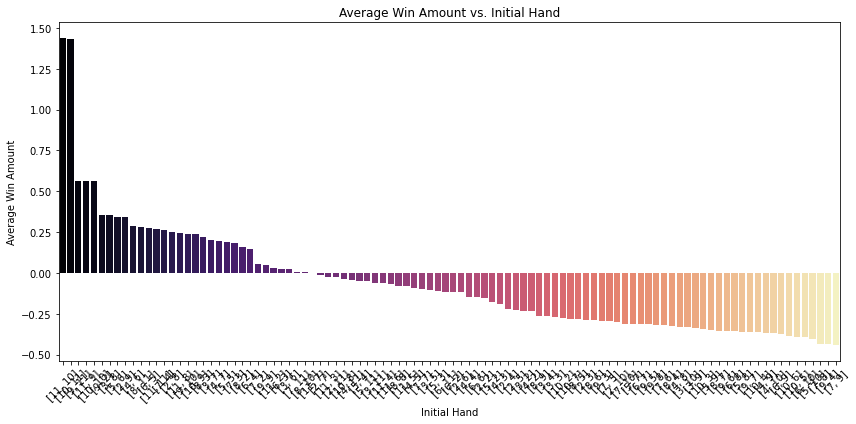
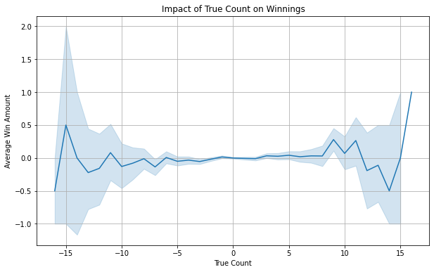
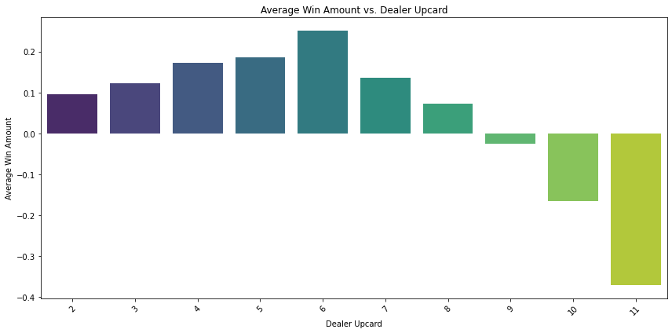
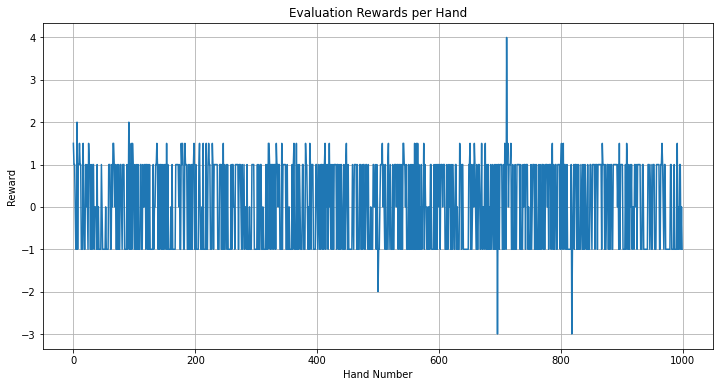

# CSE150A_Group_Project

## Dataset
We are using the following dataset for our project:

- [Blackjack Hands Dataset](https://www.kaggle.com/datasets/dennisho/blackjack-hands)

The dataset is too large to be uploaded to GitHub.  
You need to download it from the link. (50,000,000 test size.)

## PEAS description
*   **Performance Measure:**
    *   Maximize long-term winnings (or minimize losses) in Blackjack, predict the action with the highest likelihood.
*   **Environment:**
    *   Single-player Blackjack game against a dealer.
    *   The "world" consists of:
        *   A finite deck of cards (typically multiple decks shuffled together).
        *   Blackjack rules (dealer hits on soft 17, etc.).
        *   The state of the game: dealer's up card, player's hand (or hand value), actions taken, and the game outcome.
        *   The agent operates in a *static* environment as the rules don't changes.
        *   The environment is *partially observable* as the agent doesn't see the dealer's hole card or the entire deck.
        *   The environment is *stochastic* as the cards dealt are random.
        *   The environment is *sequential* as past actions affect future states.
*   **Actuators:**
    *   Actions: Hit (H), Stand (S), Double Down (D), Split (P), Surrender (R), Insurance (I), No Insurance (N).
*   **Sensors:**
    *   Dealer's up card (`dealer_up`).
    *   Player's final hand value (`player_final_value`).
    *   Prior actions of player's action.
    *   Game outcome (win, loss, push).

## Type of Agent
This Blackjack AI agent is primarily a **Utility-Based Agent**, the reasons are:

*   **Utility-Based:** The ultimate goal is to maximize the *utility* of the agent, which is measured as long-term winnings (or minimize losses). It aims to choose actions that lead to the highest expected utility. However, the actual "utility" is learned through the probability of winning, given the action.
*   **Probabilistic Agent:** The agent explicitly reasons about probabilities (different actions) to make decisions. When the agent chooses the action with the highest Q-value, the Q-values themselves represent the agent's belief about the expected return, which is influenced by the probabilities inherent in the environment. The agent might "believe" that standing has a higher expected reward in a particular state, but there's still a chance that hitting could lead to a better outcome due to the random card draw.

## Dataset Exploration
[Link to EDA notebook](https://github.com/yul243/CSE150A_Group_Project/blob/Milestone3/EDA.ipynb)







#### Key Variables in the Dataset
Below are the key variables that play a crucial role in our agent's decision-making process:
* dealer_up: The dealer's visible card at the start of the hand. This significantly impacts the player's decision.
* player_final_value: The final value of the player's hand before the outcome is determined.
*action_taken: The player's action for that hand. Possible values include:
    * H (Hit): Draw another card.
    * S (Stand): Keep the current hand.
    * D (Double Down): Double the bet and take exactly one more card.
    * P (Split): If the initial two cards are identical, split into two separate hands.
    * R (Surrender): Forfeit the hand and lose half of the bet.
    * I (Insurance): Side bet offered when the dealer shows an Ace.
* outcome: The result of the hand (Win, Loss, or Push).
* bet_amount: The amount the player wagered for that hand.
* reward: The net reward for the player after the game.
* 
#### Relationship Between Variables
* The dealer_up card strongly influences the player's best possible action.
* The player_final_value determines whether the hand is likely to win, lose, or push.
* The action_taken is based on a strategy that considers both dealer_up and player_final_value.
* The reward is directly dependent on the outcome and the bet amount.

## Probabilistic Modeling and the Agent's Setup
* State Definition: We first define what the agent "sees" or "knows" about the game at any given moment. This is the state. In our case, the state consists of:
  * Player's hand value (sum of the cards)
  * Dealer's upcard (the dealer's visible card)
  * Usable Ace (whether the player has an Ace that can be counted as 11 without busting)
  * True Count (a card counting metric).
* Action Space: We define the set of actions the agent can take. For simplicity, we focus on just two:
    * Hit (H): Take another card.
    * Stand (S): End the hand and compare with the dealer. More advanced versions could include Double Down, Split, Surrender.
* Reward Function: We define how the agent is "rewarded" or "punished" for its actions.
  * The reward is based on the outcome of the hand:
    * Win: Positive reward (the amount won).
    * Loss: Negative reward (the amount lost).
    * Push (Tie): Zero reward.
* Q-Table Initialization: The agent's "memory" is stored in a Q-table. This table is initialized with zeros. It's a dictionary-like structure that maps each possible state-action pair to an estimated Q-value. We use a defaultdict so we don't have to pre-populate the table.

## Training the Model
[Link to our code for training process](https://github.com/yul243/CSE150A_Group_Project/blob/Milestone3/Blackjack_qlearning_agent.ipynb)
1. Iterate Through Episodes.
2. Observe the State: For each hand in the training data, the agent observes the current state (player hand, dealer upcard, etc.).
3. Choose an Action (Epsilon-Greedy): The agent uses an epsilon-greedy policy to choose an action:
4. With probability epsilon (the exploration rate), the agent chooses a random action (either Hit or Stand).
5. With probability 1 - epsilon, the agent chooses the action that has the highest estimated Q-value in the Q-table for the current state. This is to exploit its current knowledge.
6. Check for valid actions: Check for valid actions based on the rules
7. Take the Action: The agent "takes" the action and receives a reward based on the outcome of the hand.
8. Observe the Next State: The agent observes the next state (the new player hand, if it hit, or the end of the hand).
9. Update the Q-Table: Update rule:
```python
Q(state, action) = Q(state, action) + alpha * (reward + gamma * max(Q(next_state, all_actions)) - Q(state, action))
```
10. At last we store our Q-table into a pickle file and easier for future use.
[Link to our pkl file](https://github.com/yul243/CSE150A_Group_Project/blob/Milestone3/blackjack_q_table.pkl)

## Evaluating the Model
1. Iterate Through Evaluation Hands: The agent processes a set of blackjack hands.
Observe the State: The agent observes the current state.
2. Choose the Best Action: The agent chooses the action with the highest Q-value in the Q-table for the current state. There's no random exploration during evaluation.
3. Take the Action: The agent "takes" the action and receives a reward.
4. Calculate the Average Reward: The total reward is calculated over the evaluation hands, and the average reward per hand is computed.

We regard the following as the Evaluation Metrics:
- Average Reward per Hand: This is the primary metric. It indicates the agent's average profit or loss per hand. A positive average reward means the agent is making a profit.
- Win Rate: The percentage of hands the agent wins.
- Comparison to Baseline: Compare the agent's performance to a basic strategy player or a random player.

We get the following graphs as a process shower:



### Conclusion of the Reinforcement Learning Model

#### Evaluation Summary

Our reinforcement learning agent was designed to maximize long-term winnings in Blackjack. The agent learned to make optimal decisions based on Q-values through the training process, selecting the best action based on expected returns.

The key evaluation metrics used to assess the model's performance were:
* Average Reward per Hand: The agent's average profit per round is 0.0325, which means a small return per round.
* Win Rate: The agent demonstrated a win rate slightly above a random baseline, showing that it successfully learned to improve decision-making over time.
* Comparison to Baseline: Regarding profitability, our agent outperformed a basic strategy player or a random action selection approach.

#### Performance Insights
* The positive average reward indicates that the agent makes better decisions than a random player.
* The Q-learning approach effectively improved the agent's decision-making through repeated iterations and reinforcement.
* Some variance in reward distribution was observed, which is expected due to the stochastic nature of Blackjack.

#### Visualization Analysis
* Evaluation Rewards per Hand: The graph shows fluctuations in reward values over multiple hands, confirming the agent's learned policy.
* Distribution of Rewards: The histogram shows that while most hands result in small profits or losses, there is an overall trend toward profitability.


### Potential Improvements

While the agent has demonstrated a positive performance, there are several areas for improvement:

1. Increased Training Episodes:
    * Currently, the model was trained with 100 episodes, which may not be sufficient for the agent to fully converge on an optimal strategy.
    * Increasing training iteration to 5000 - 10,000 episodes would likely enhance decision-making.
2. Hyperparameter Tuning:
    * Further tuning of alpha(learning rate), gamma(discount factor), and epsilon(exploration rate) could help optimize learning efficiency.
    * Adjusting the exploration-exploitation tradeoff dynamically might improve performance.
3. Enhanced State Representation:
    * The agent currently bases its decisions on a limited set of features. Incorporating more detailed features, such as opponent tendencies or deck composition, could improve decision-making.
    * Using neural network-based function approximation (e.g., Deep Q-Networks) instead of a tabular Q-table might allow the agent to generalize better across unseen states.
4. GPU Acceleration & Parallelization:
    * Since Blackjack requires significant computational resources for simulation, leveraging GPU acceleration could significantly speed up training.
    * Implementing batch updates instead of single-step Q-learning updates might improve sample efficiency.